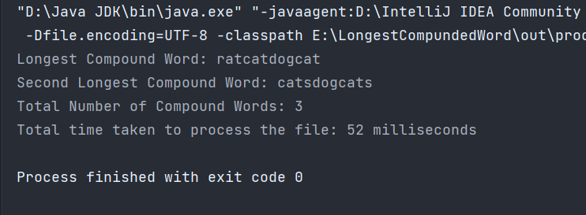
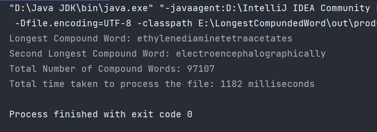

# Steps to execute code
___

1. You must have a `JDK installed` on your computer and if not then install it from here depending on your system requirements:
    > https://www.oracle.com/in/java/technologies/javase/jdk11-archive-downloads.html
2. You Must have any of the  java editor installed on your system.
3. Now Download the Code from repository as `ZIP Code` or install it through `Git`.
4. Execute the program `LongestCompounded.java` in your system to see the results.

## Output
___

>Output from Input_01.txt file.

>Output from Input_02.txt file.

## Complexity
___
The complexity of my algorithm is `O(kN)` where N is the number of the words in the input list, and k is the maximum number of the  words in a given compound word. The number k may vary from one list to another, but it’ll generally be a constant number like 5 or 10. So, the algorithm is linear in number of words in the list, which is an optimal solution to the problem.

## Approach
___
Given a sorted list of words, find the longest compound word in the list that is constructed by concatenating the words in the list. For example, if the input list is: ['cat', 'cats', 'catsdogcats', 'catxdogcatsrat', 'dog', 'dogcatsdog', 'hippopotamuses', 'rat', 'ratcat', 'ratcatdog', 'ratcatdogcat']. Then the longest compound word is 'ratcatdogcat' with 12 letters. Note that the longest individual words are 'catxdogcatsrat' and 'hippopotamuses' with 14 letters, but they're not fully constructed by other words. Former one has an extra 'x' letter, and latter is an individual word by itself not a compound word.

**Using Trie, which let words to share prefixes**

Let’s illustrate the process with an example, the first word is cat and we add it to the trie. Since it doesn’t have a prefix, we continue. Second word is cats, we add it to the trie and check whether it has a prefix, and yes it does, the word cat. So we append the pair <’cats’, ‘s’> to the queue, which is the current word and the suffix. The third word is catsdogcats, we again insert it to the trie and see that it has 2 prefixes, cat and cats. So we add 2 pairs <’catsdogcats’, ‘sdogcats’> and <’catsdogcats’, ‘dogcats’> where the former suffix correspond to the prefix cat and the latter to cats. We continue like this by adding <’catxdogcatsrat’, ‘xdogcatsrat’> to the queue and so on. And here’s the trie formed by adding example the words in the problem definition.

After building the trie and the queue, then we start processing the queue by popping a pair from the beginning. As explained above, the pair contains the original word and the suffix we want to validate. We check whether the suffix is a valid or compound word. If it’s a valid word and the original word is the longest up to now, we store the result. Otherwise we discard the pair. The suffix may be a compound word itself, so we check if the it has any prefixes. If it does, then we apply the above procedure by adding the original word and the new suffix to the queue. If the suffix of the original popped pair is neither a valid word nor has a prefix, we simply discard that pair.
 
 
